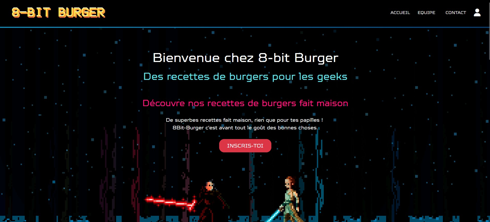

<!-- (Fait PAR JON) -->

<h1 align="center">Re 👋, ceci est le Repo' pour le bloc 3 du CESI</h1>
<h3 align="center">Thème: "Développer un site web et son application mobile"</h3> 

  
 

<h4>Le site web est en ligne 😁 (Merci Mélanie ! ^^)  
Vous pouvez le consulter en cliquant ici:</h4>

[8bit-burger.melanieroussy.fr](https://8bit-burger.melanieroussy.fr/)

  

## **L'équipe:**   

- [Mélanie Roussy](https://github.com/kitaah)   
- [Jean Rafael MENDES](https://github.com/Rafael3378)   
- [Jonathan ZEREN](https://github.com/jon-zer-1113)   

**<h3 align="center">Langages et outils:</h3> **

 &nbsp; &nbsp; &nbsp;&nbsp; &nbsp; &nbsp;&nbsp; &nbsp;&nbsp; &nbsp; &nbsp;&nbsp; &nbsp;&nbsp; &nbsp; &nbsp;&nbsp; &nbsp; &nbsp;<a href="https://www.adobe.com/products/xd.html" target="_blank" rel="noreferrer">&nbsp; &nbsp; &nbsp; </a>&nbsp; &nbsp; &nbsp;
    

- 🔭 Gestion du projet: **Notion**

- 💬 Modélisation BDD: **JMerise (MCD, MLD, MPD)**

- 🌱 Analyse du besoin: **Rapport**

- 🤝 Gestion du code (Versioning): **Git et GitHub**

- 📝 Restitution du projet: **PowerPoint et rapport**

- 📫 Back-end & serveur: **WAMP (Apache, MySQL, PHP, phpMyAdmin)**

- 👨‍💻 Front-end: **HTML, Bootstrap, CSS, JavaScript, SASS**

- 🎨 Maquette: **Adobe XD**

   

